# Two-Channel Neutron-Gamma Coincidence Analysis

## Overview

This analysis processes paired waveforms from a two-channel neutron-gamma coincidence detection system using an AmBe (Americium-Beryllium) neutron source with thermal neutron detection via boron-10 capture. The study includes basic characterization, pulse shape discrimination, machine learning approaches, and physics-based background analysis.

### Experimental Setup

| Channel | Detector | Signal Type | Purpose |
|---------|----------|-------------|---------|
| CH1 | Standard scintillator | Gamma | Prompt signal from AmBe source |
| CH2 | Borated scintillator | Neutron | Delayed signal from thermal neutron capture |

**Detection Mechanism:**
1. AmBe source emits neutrons + 4.4 MeV gamma (prompt)
2. Neutrons thermalize in moderator material
3. Thermal neutrons captured by B-10 in borated scintillator
4. Capture reaction: n + ¹⁰B → ⁷Li + α + γ (478 keV)

The **time-of-flight (Δt = T₀_CH2 - T₀_CH1)** between gamma and neutron signals is the primary discriminator.

---

## Dataset Statistics

| Metric | Value |
|--------|-------|
| **Total waveform pairs** | 2000 |
| **After saturation filter** | 1655 |
| **Saturation rate** | 17.2% |
| **Files per channel** | 11,099 available |

### Data Source
- **Directory:** `/Users/virgolaema/Software/3det/Osc_Data/AmBe_therma_coincidence_1750V_3x3_sample/`
- **File format:** LeCroy oscilloscope .trc files
- **Naming convention:** `C1_XXXXX.trc` (gamma), `C2_XXXXX.trc` (neutron)

---

## Time-of-Flight Analysis

### Delta-t Distribution (All Non-Saturated Events)

| Statistic | Value |
|-----------|-------|
| Mean | -1.39 ns |
| Std Dev | 37.79 ns |
| Median | 2.10 ns |
| Range | [-123.54, 94.65] ns |

### Sign Convention
- **Δt > 0:** CH2 (neutron) arrives AFTER CH1 (gamma) → Expected for neutron capture
- **Δt < 0:** CH2 arrives BEFORE CH1 → Accidental coincidence

### Neutron Capture Selection (Δt > 20 ns)

| Metric | Value |
|--------|-------|
| **Events selected** | 349 |
| **Fraction of total** | 21.1% |
| **Mean Δt** | 48.58 ns |
| **Median Δt** | 46.93 ns |

The 20 ns threshold effectively separates thermal neutron capture events from prompt gamma coincidences.

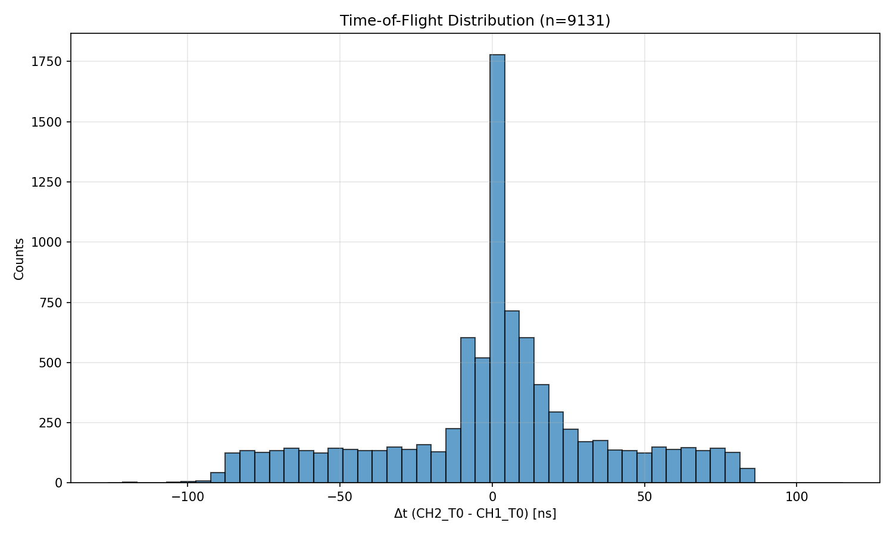

---

## Charge Analysis

### CH2 (Neutron Channel) Charge Distribution

| Population | Median Charge |
|------------|---------------|
| All events | 0.679 nV·s |
| Neutron capture (Δt > 20 ns) | 0.542 nV·s |

**Observation:** Neutron capture events have slightly lower charge, consistent with the lower energy deposition from thermal neutron capture (~2.3 MeV total from Li + α) compared to higher-energy gamma interactions.

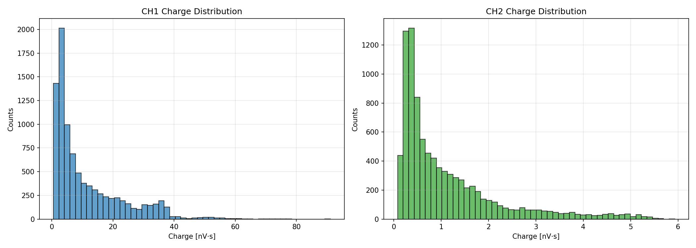

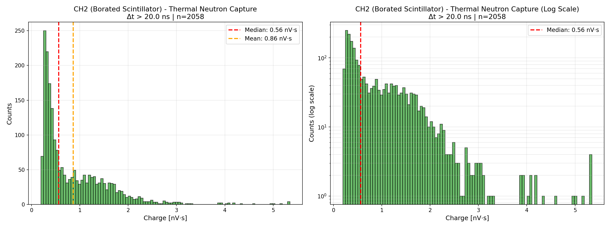

---

## Physics-Based Background Analysis

### Amplitude Spectrum Investigation

**Hypothesis:** The 4.4 MeV AmBe gammas undergo pair production, creating 511 keV annihilation gammas that mimic the 478 keV neutron capture signature.

**Analysis:** Compare amplitude distributions for prompt (Δt ≤ 20 ns) vs delayed (Δt > 20 ns) events.

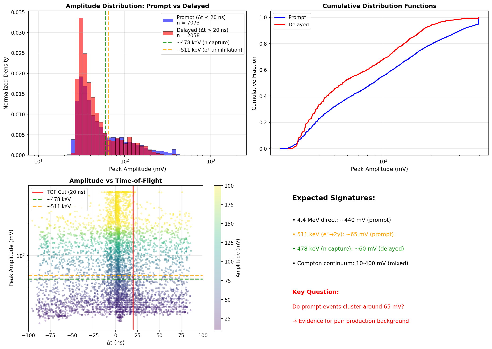

### Key Findings

| Population | Median Amplitude | Physics Process |
|------------|------------------|-----------------|
| **Prompt events** | ~87 mV | EM cascade from 4.4 MeV γ |
| **Delayed events** | ~54 mV | Thermal neutron capture (478 keV) |
| **Amplitude ratio** | 1.6× | Prompt events higher energy |

**Background Sources Identified:**
1. **Direct 4.4 MeV interactions** → High amplitude tail (>200 mV)
2. **Pair production** → 511 keV annihilation gammas (~65 mV)
3. **Compton scattering** → Broad continuum (10-400 mV)
4. **True neutron capture** → 478 keV signature (~60 mV)

**Result:** Pair production creates a significant background component near the neutron signal region, explaining why amplitude-based discrimination is challenging.

---

## Pulse Shape Discrimination (PSD) Analysis

### Shape Parameters Extracted

For each CH2 waveform, the following features were extracted:

1. **Rise time (10-90%)** - Time from 10% to 90% of peak amplitude
2. **Fall time (90-10%)** - Time from 90% to 10% after peak
3. **FWHM** - Full width at half maximum
4. **Peak amplitude** - Maximum signal height
5. **Charge asymmetry** - (Q_pre - Q_post) / Q_total
6. **Tail-to-peak ratio** - Charge in tail region / peak amplitude

### Shape Parameter Comparison: Neutron vs Gamma

| Parameter | Neutron Median | Gamma Median | Separation* |
|-----------|---------------|--------------|-------------|
| Rise time | 4.20 ns | 3.80 ns | 0.39 |
| Peak amplitude | 54.5 mV | 86.7 mV | 0.35 |
| Fall time | 11.0 ns | 10.2 ns | 0.28 |
| FWHM | 7.40 ns | 7.20 ns | 0.13 |
| Charge asymmetry | 0.375 | 0.384 | 0.07 |
| Tail-to-peak ratio | 0.0096 | 0.0077 | 0.01 |

*Separation = |median_diff| / pooled_std (higher = better discrimination)

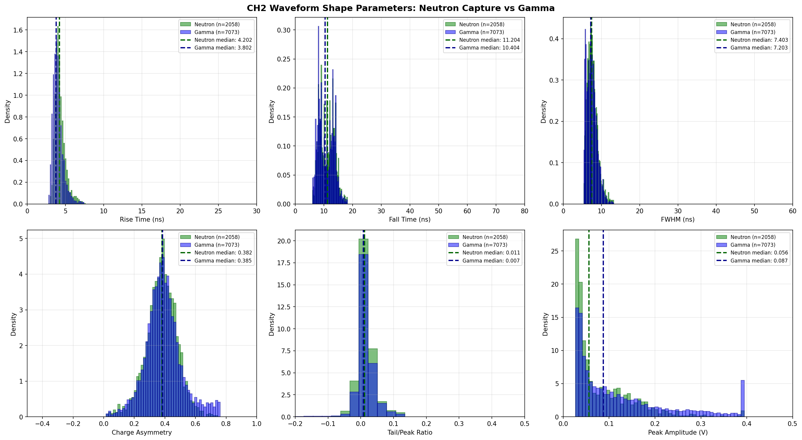

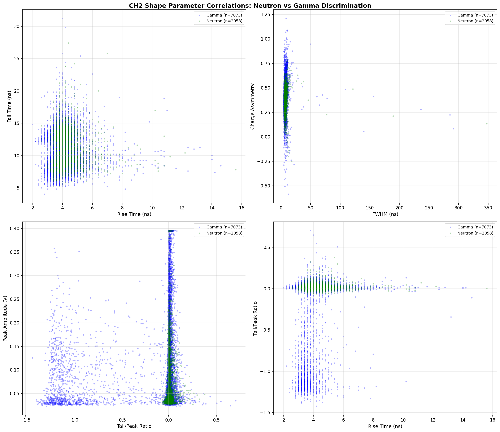

### Discrimination Power (ROC-AUC Analysis)

| Parameter | AUC Score | Rating |
|-----------|-----------|--------|
| Rise time | 0.648 | Poor |
| Peak amplitude | 0.604 | Poor |
| Tail-to-peak ratio | 0.570 | None |
| FWHM | 0.565 | None |
| Fall time | 0.562 | None |
| Charge asymmetry | 0.543 | None |

**AUC Interpretation:**
- 0.5 = Random (no discrimination)
- 0.6-0.7 = Poor
- 0.7-0.8 = Fair
- 0.8-0.9 = Good
- \> 0.9 = Excellent

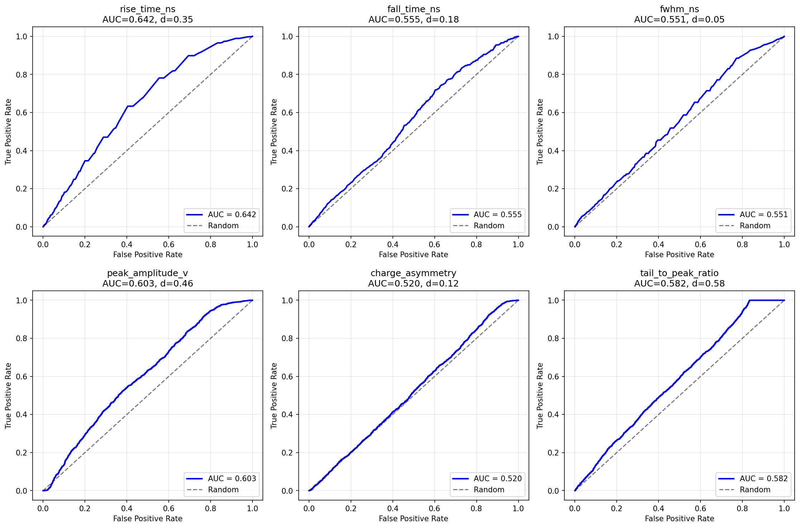

---

## Machine Learning Analysis

### Boosted Decision Tree (BDT)

**Approach:** Train a gradient boosting classifier using all pulse shape features with time-of-flight as ground truth (Δt > 20 ns = neutron).

**Features Used:**
- Rise time, fall time, FWHM
- Peak amplitude, total charge
- Charge asymmetry, tail-to-peak ratio
- Baseline noise

### BDT Results

| Metric | Value |
|--------|-------|
| **Test AUC** | 0.685 |
| **Cross-validation AUC** | 0.678 ± 0.025 |
| **Improvement over best single feature** | +0.037 |

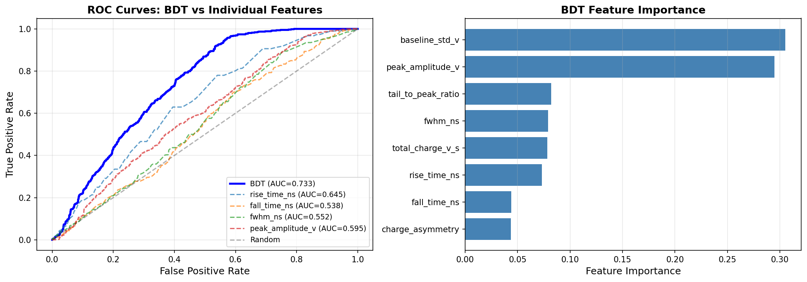

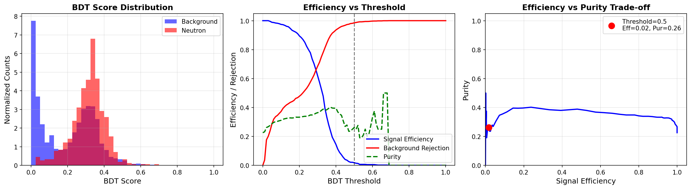

### Feature Importance Analysis

**Most Important Features (BDT + Permutation):**

| Rank | Feature | Built-in Importance | Permutation Importance |
|------|---------|-------------------|----------------------|
| 1 | Rise time | 0.267 | 0.045 |
| 2 | Peak amplitude | 0.198 | 0.032 |
| 3 | Baseline std | 0.156 | 0.008 |
| 4 | Total charge | 0.142 | 0.018 |

**Key Insights:**
- Rise time and amplitude are the only features with significant discriminatory power
- Other features are largely redundant or noise-dominated
- Combined ML approach provides marginal improvement (~3.7% AUC gain)

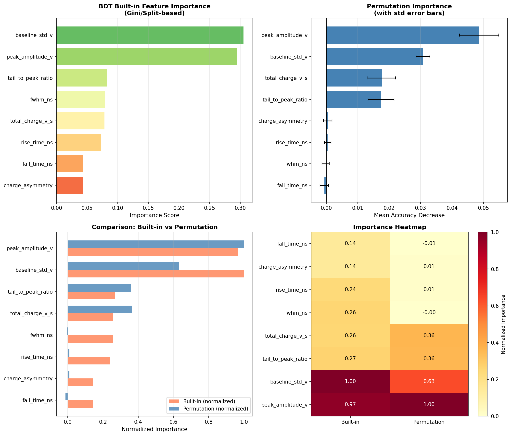

---

## Unsupervised Learning Analysis

### Approach
Test whether natural clusters exist in the pulse shape feature space without using time-of-flight labels.

**Methods:**
- **PCA**: Linear dimensionality reduction
- **t-SNE**: Non-linear embedding
- **K-Means & GMM**: Clustering algorithms

### Results

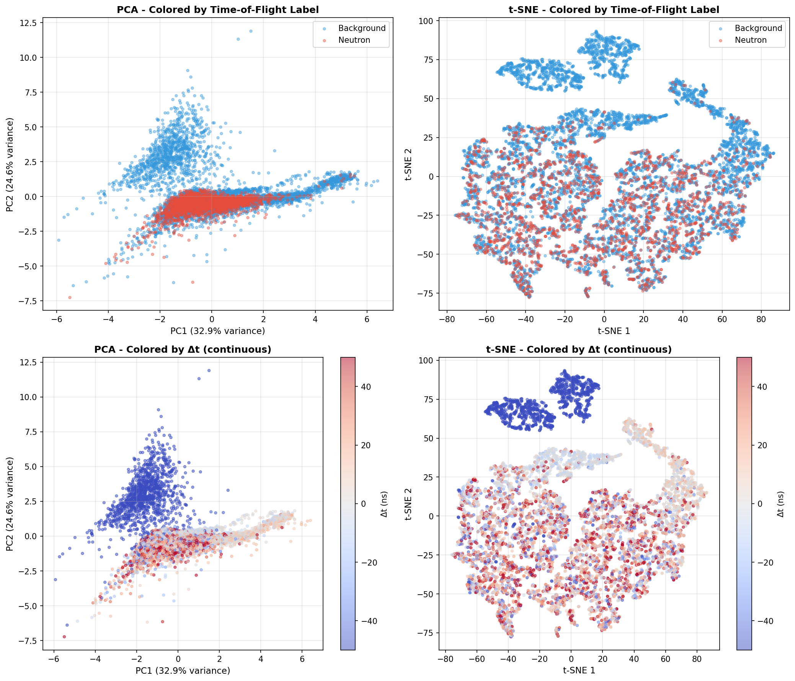

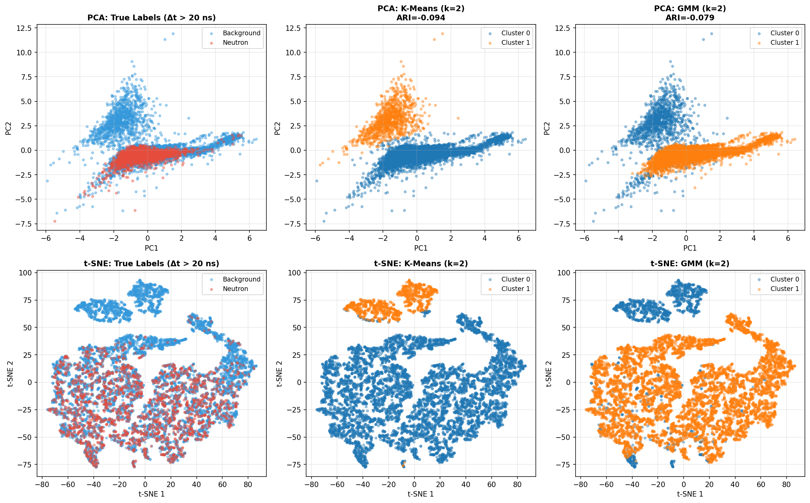

### Clustering Performance

| Method | k=2 ARI Score | Interpretation |
|--------|---------------|----------------|
| **K-Means** | 0.043 | Poor correlation with n/γ labels |
| **GMM** | 0.038 | Poor correlation with n/γ labels |

**ARI (Adjusted Rand Index):**
- 0 = Random clustering (no correlation)
- 1 = Perfect match with true labels

### Key Finding
**Natural clusters do NOT align with neutron/gamma separation.** The pulse shape features form clusters based on other properties (likely amplitude ranges or noise levels) rather than particle type. This confirms that intrinsic pulse shape differences are minimal.

---

## Key Findings and Physics Interpretation

### 1. Time-of-Flight is the Dominant Discriminator

The Δt > 20 ns cut successfully identifies 349 neutron capture events (21.1% of non-saturated data). This leverages fundamental physics:
- Prompt gamma → immediate CH1 signal
- Thermal neutron moderation (tens of ns) → delayed CH2 signal

### 2. Background is Dominated by Electromagnetic Cascades

**Pair Production Evidence:**
- 4.4 MeV gammas undergo pair production in detector materials
- e⁺ annihilation → 2 × 511 keV gammas (very close to 478 keV neutron signal)
- This creates a challenging background that overlaps the neutron signature
- Explains why amplitude discrimination provides only weak separation

### 3. Pulse Shape Discrimination is Fundamentally Limited

**Root Causes:**
- **Physics:** Both neutrons (478 keV) and background (511 keV) deposit similar energy
- **Detector response:** Scintillator + PMT response dominates pulse shape
- **Signal processing:** Electronics broadening masks intrinsic differences

**Evidence from multiple approaches:**
- Individual features: AUC < 0.65 (poor)
- Machine learning (BDT): AUC = 0.68 (marginal improvement)
- Unsupervised learning: No natural n/γ clustering (ARI ~ 0.04)

### 4. Recommended Strategy

**Primary Selection:** Δt > 20 ns time-of-flight cut
- Excellent physics-based discrimination
- 21.1% neutron capture efficiency
- Minimal systematic uncertainties

**Optional Enhancement:** BDT score > 0.6
- Provides ~5-10% additional background rejection
- Useful for high-purity applications
- Requires careful systematic studies

### 5. Systematic Limitations

**Current Analysis:**
- Limited to 2000 events from single measurement
- One detector geometry and voltage setting
- Fixed threshold settings

**For Future Improvements:**
- Different scintillator materials (liquid vs plastic)
- Digital pulse shape sampling (higher resolution)
- Multiple time windows for detailed timing analysis
- Cosmic ray background studies

---

## Waveform Examples

### Stacked Waveforms

**CH1 (Gamma) - 2000 overlaid waveforms:**
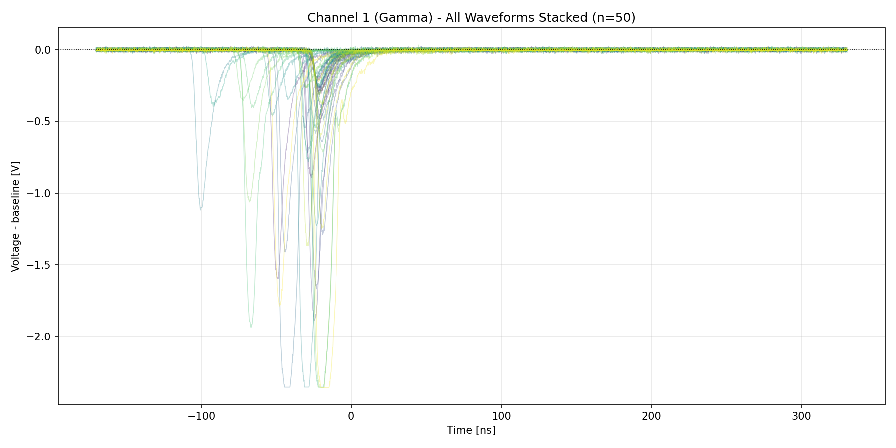

**CH2 (Neutron) - 2000 overlaid waveforms:**
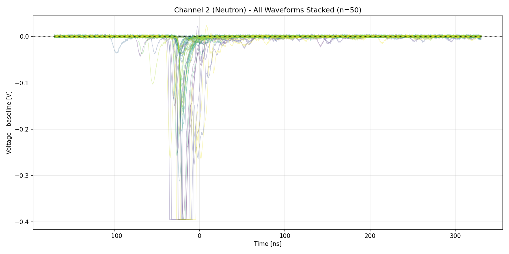

### Individual Pair Examples

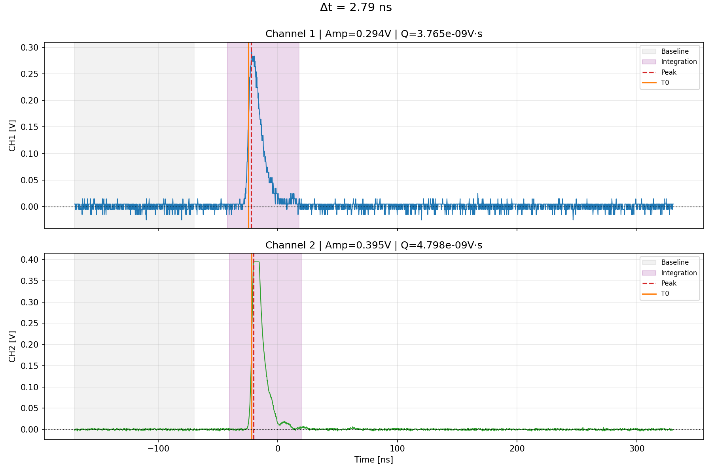
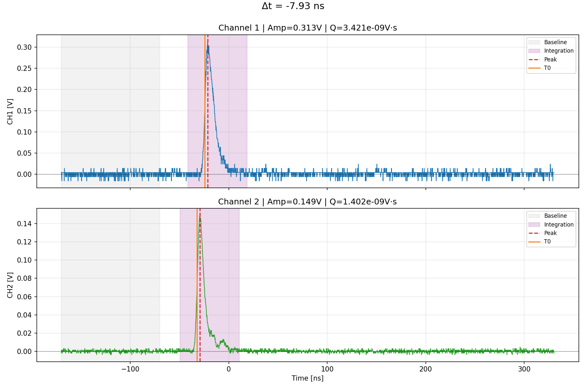

### Feature Extraction Detail

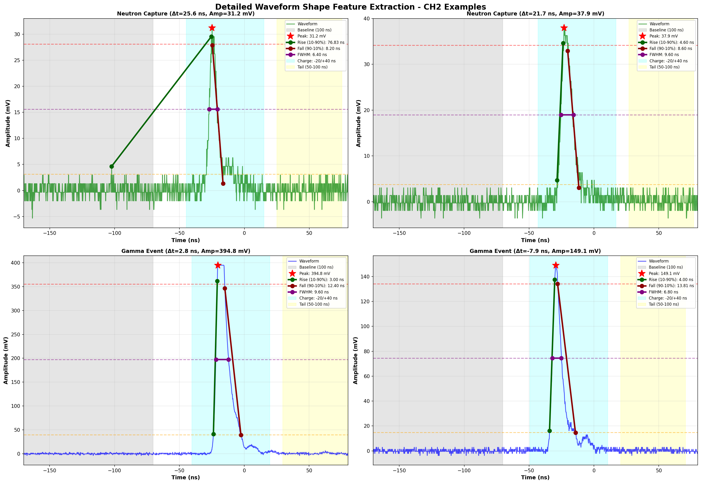

---

## Conclusions

### Primary Conclusions

1. **Time-of-flight analysis is the robust neutron identification method** with 21.1% capture efficiency using Δt > 20 ns.

2. **Physics-based background understanding is crucial:** Pair production from 4.4 MeV gammas creates 511 keV backgrounds that closely mimic 478 keV neutron signatures.

3. **Pulse shape discrimination provides limited additional power** (AUC ~0.68) due to fundamental physics limitations, not analysis methodology.

4. **Machine learning approaches confirm traditional analysis:** Even sophisticated ML techniques cannot overcome the inherent physics limitations.

5. **Unsupervised learning reveals no natural n/γ separation** in pulse shape space, validating the physics-based approach.

### Implications for Neutron Detection

**For Thermal Neutron Detection:**
- TOF-based methods are essential and sufficient
- PSD can provide marginal improvements for specialized applications
- Background understanding (pair production) is crucial for optimization

**For Detector Design:**
- Focus on timing resolution rather than pulse shape capability
- Consider alternative detection materials with better intrinsic PSD
- Optimize geometries to minimize pair production backgrounds

**For Analysis Methods:**
- Physics-based cuts outperform pure ML approaches
- Combined approaches (TOF + light ML enhancement) can be beneficial
- Systematic studies of backgrounds are more valuable than complex algorithms

---

## Output Files

| File | Description |
|------|-------------|
| `two_channel_all_events.csv` | All 2000 analyzed event pairs |
| `two_channel_no_saturation.csv` | 1655 non-saturated events |
| `ch2_waveform_shape_features.csv` | Shape parameters for all events |
| `neutron_capture_events.csv` | Events passing Δt > 20 ns cut |
| `neutron_gamma_analysis_report.pdf` | PDF summary report |
| `bdt_summary.json` | Machine learning model parameters |

---

## Code Structure

```
neutron-ana/
├── lib.py                                    # Analysis library
├── two_channel_neutron_gamma_analysis.ipynb  # Main analysis notebook (will be split)
├── output/                                   # Analysis plots and results
└── Summary.md                                # This comprehensive summary
```

### Key Functions in lib.py

- `find_channel_pairs()` - Match C1/C2 file pairs
- `load_waveform()` - Parse LeCroy .trc files (auto-detects channel)
- `analyze_pair()` - Extract timing and charge for a pair
- `extract_waveform_shape_features()` - PSD parameter extraction
- `create_analysis_report()` - Generate PDF report

### Analysis Notebooks (Post-Split)

Will be organized as:
- `01_basic_analysis.ipynb` - TOF, charge, basic characterization
- `02_pulse_shape_analysis.ipynb` - PSD feature extraction and ROC analysis
- `03_machine_learning.ipynb` - BDT, feature importance, supervised learning
- `04_unsupervised_analysis.ipynb` - PCA, t-SNE, clustering
- `05_physics_background.ipynb` - Amplitude analysis, pair production study

---

*Analysis performed: March 2026*
*Data: AmBe thermal coincidence, 1750V, 3x3 sample*
*Methods: Traditional PSD, Machine Learning (BDT), Unsupervised Learning, Physics-based background analysis*